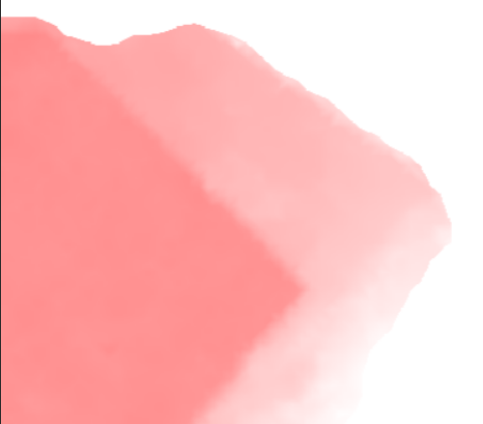

近期在工作中有涉及一个水深自动化上图的工作，将海图的dwg文件提取水深点生成水深热力图，是以做此纪录，以便查阅与分享。
# 环境与软件
需要有arcgis的环境，geoserver，详细部署请参考网络。

# 处理流程
## 提取点要素
将dwg文件中点要素提取出来并且通过查询语句过滤，保存成shape以便后续使用，若对shp文件成果无需求的可直接提取featureclass进行后续处理，这是一个通用cad转shp的方法。
```c
          public void CadToShapeFile(string filepath , string type , string outputpath , string whereClause) {
            if (!File.Exists(filepath) && System.IO.Path.GetExtension(filepath) != ".dwg") {
                return;
            }
            string fileDirectory = System.IO.Path.GetDirectoryName(filepath);
            string fileName = System.IO.Path.GetFileName(filepath);
                //打开cad获取要素 
            IWorkspaceFactory pWF = new CadWorkspaceFactory();
            IWorkspace pW = pWF.OpenFromFile(fileDirectory, 0);
            IFeatureWorkspace pFW = (IFeatureWorkspace)pW;
            IFeatureClass pFeatureClass = pFW.OpenFeatureClass(fileName+":"+type);

            string outputDirectory = System.IO.Path.GetDirectoryName(outputpath);
            string outputName = System.IO.Path.GetFileNameWithoutExtension(outputpath);
            
            //打开shapefile文件夹
            IWorkspaceFactory pWSF = new ShapefileWorkspaceFactoryClass();
            IWorkspace pOutWorkspace = pWSF.OpenFromFile(outputDirectory, 0);
            IDataset pOutDataSet = pOutWorkspace as IDataset;
            IWorkspaceName pOutWorkspaceName = pOutDataSet.FullName as IWorkspaceName;

            //用cad的featureclass
            IDataset pInDataSet = pFeatureClass as IDataset;
            IFeatureClassName pInFeatureClassName = pInDataSet.FullName as IFeatureClassName;

            IFeatureClassName pOutFeatureClassName = new FeatureClassNameClass();
            IDatasetName pOutDataSetName = pOutFeatureClassName as IDatasetName;
            pOutDataSetName.WorkspaceName = pOutWorkspaceName;
            pOutDataSetName.Name = outputName;


            IQueryFilter pInQueryFilter = new QueryFilterClass()
            {
                WhereClause = whereClause, 
            };

            IFields pOutFields = null;
            IEnumFieldError enumFieldError = null;
            IFields fields = pFeatureClass.Fields;
            IFieldChecker fieldChecker = new FieldCheckerClass();
            IWorkspace pInWorkspace = pInDataSet.Workspace;
            fieldChecker.InputWorkspace = pInWorkspace;
            fieldChecker.ValidateWorkspace = pOutWorkspace;
            fieldChecker.Validate(fields, out enumFieldError, out pOutFields);

            IFeatureDataConverter featureDataConverter = new FeatureDataConverterClass();
            featureDataConverter.ConvertFeatureClass(pInFeatureClassName, pInQueryFilter, null, pOutFeatureClassName, null, pOutFields, "", 100, 0);

            System.Runtime.InteropServices.Marshal.ReleaseComObject(featureDataConverter);
            System.Runtime.InteropServices.Marshal.ReleaseComObject(pOutWorkspace);
            System.Runtime.InteropServices.Marshal.ReleaseComObject(pFeatureClass);
            System.Runtime.InteropServices.Marshal.ReleaseComObject(pW);
        }
```
## 生成tin
通过提取出来的带高程值的点生成tin文件，并且通过约束三角网周长来使其外轮廓更贴近于点集的外包多边形。
```c
            IGeoDataset pGeoDataset = pFeatureClass as IGeoDataset;
            ITinEdit pTinEdit = new TinClass();
            pTinEdit.InitNew(pGeoDataset.Extent);
            object pObj = Type.Missing;
            //将点集作为约束点
            pTinEdit.AddFromFeatureClass(pFeatureClass, null, pField, null,
            esriTinSurfaceType.esriTinMassPoint, ref pObj);
            pTinEdit.SaveAs(pPath, ref pObj);
            pTinEdit.Refresh();
            ITin pTin = pTinEdit as ITin;
            //约束三角网周长
            new Geoprocessor { OverwriteOutput = true, }.Execute(new DelineateTinDataArea { in_tin = pTin, max_edge_length = length, }, null);
            return pTinEdit as ITin;
```
## 生成栅格数据
通过GP将tin生成栅格数据。
```c
            Geoprocessor gp = new Geoprocessor();
            gp.OverwriteOutput = true;
            TinRaster tinRaster = new TinRaster();
            tinRaster.in_tin = tin;
            tinRaster.out_raster = path;
            tinRaster.data_type = "FLOAT";
            tinRaster.method = "LINEAR";
            tinRaster.sample_distance = "CELLSIZE " + pixelSize;
            tinRaster.z_factor = 1;
            gp.Execute(tinRaster, null);
```
## 服务配置发布
通过geoserver rest api来注册tif数据源和发布图层。
```js
//注册数据源
this.$axios({
   method:"post",
   url: geoserver.url + "workspaces/{workspace}/coveragestores",
   headers: {Authorization : geoserver.auth},
   data:{}
 })
```
```js
//注册图层
this.$axios({
   method:"post",
   url: geoserver.url + "workspaces/{workspace}/coveragestores/{coveragestores}/coverages",
   headers: {Authorization : geoserver.auth},
   data:{}
 })
```
## 服务调用
前端使用cesium调用wms服务，并且可以通过sld_body来更改样式。
```js
      let imageryProvider = new Cesium.WebMapServiceImageryProvider(param)
      this.wmsLayer = window.app.viewer.imageryLayers.addImageryProvider(imageryProvider)
```
通过最大最小值和色带分类动态赋值，此处采用等间距的分类方法
```js
    getStyle(layer,min,max,classes){
      let colorMapEntry = "";
      let interval = (max-min)/classes

      for(let i = 0 ; i < classes ; i++){
        let quantity = min + i*interval;
        colorMapEntry = colorMapEntry + `<ColorMapEntry color="${colorRamp[i]}" quantity="${quantity}"/>`
      }

      const sld = `<?xml version="1.0" encoding="UTF-8"?>
      <StyledLayerDescriptor version="1.0.0" xmlns="http://www.opengis.net/sld" xmlns:ogc="http://www.opengis.net/ogc"
      xmlns:xlink="http://www.w3.org/1999/xlink" xmlns:xsi="http://www.w3.org/2001/XMLSchema-instance"
      xsi:schemaLocation="http://www.opengis.net/sld http://schemas.opengis.net/sld/1.0.0/StyledLayerDescriptor.xsd">
      <NamedLayer>
      <Name>${layer}</Name>
      <UserStyle>
      <Name>style</Name>
      <Title>NDVI distribution</Title>
      <FeatureTypeStyle>
      <Rule>
      <RasterSymbolizer>
      <Opacity>1.0</Opacity>
      <ColorMap>
        ${colorMapEntry}
      </ColorMap>
      </RasterSymbolizer>
      </Rule>
      </FeatureTypeStyle>
      </UserStyle>
      </NamedLayer>
      </StyledLayerDescriptor>`
      return sld;
    },
```


# 结尾
参考：
https://blog.csdn.net/giser_whu/article/details/25747279
https://blog.csdn.net/RicardoMTan/article/details/106213973
若有参考到的没赋链接的请告知本人，本人注明或做出修改，万分抱歉。
若需转载请注明本文链接，感谢观看。
